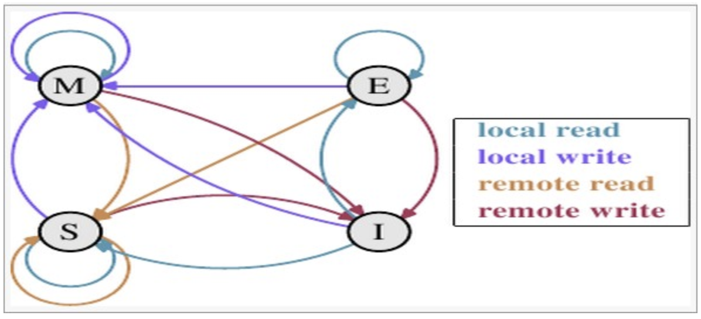

# 第2章 并发基础

## CPU多级缓存

* 为什么需要CPU cache：CPU频率太快，快到主存跟不上，这样在CPU处理器时钟周期内，CPU常常需要等待贮存，浪费资源。所以cache的出现，是为了缓解CPU和内存之间速度的不匹配问题（结构：cpu->cache->memory）。
* CPU cache有什么意义：时间局部性和空间局部性。

## CPU多级缓存-缓存一致性（MESI）

* 用于保证多个CPU cache之间缓存共享数据的一致。（四种操作：local read、local write、remote read、remote write）

触发事件

| 触发事件 |            描述            |
| :------: | :------------------------: |
| 本地读取 | 本地cache读取本地cache数据 |
| 本地写入 | 本地cache写入本地cache数据 |
| 远端读取 | 其他cache读取本地cache数据 |
| 远端写入 | 其他cache写入本地cache数据 |

MESI状态说明

> 缓存行（cache line ）：缓存存储数据的单元。

|          状态          |                             描述                             |                           监听任务                           |
| :--------------------: | :----------------------------------------------------------: | :----------------------------------------------------------: |
|   M修改（Modified）    | 该cache line有效，数据被修改了，和内存中的数据不一致，数据只存在于本cache中 | 缓存行必须时刻监听所有试图读该缓存行相对就主存的操作，这种操作必须在缓存将该缓存行写回主存并将状态变成S（共享）状态之前被延迟执行。 |
| E独享互斥（Exclusive） | 该cache line有效，数据和内存中的数据一致，数据只存在于本cache中 | 缓存行也必须监听其它缓存读主存中该缓存行的操作，一旦有这种操作，该缓存行需要变成S（共享）状态。 |
|    S共享（Shared）     | 该cache line有效，数据和内存中的数据一致，数据存在于很多cache中 | 缓存行也必须监听其它缓存使该缓存行无效或者独享该缓存行的请求，并将该缓存行变成无效（Invalid）。 |
|    I无效（Invalid）    |                       该cache line无效                       |                              无                              |

cache line状态调整（当一个cache line的调整的状态的时候，另外一个cache line 需要调整的状态）

|      |  M   |  E   |  S   |  I   |
| :--: | :--: | :--: | :--: | :--: |
|  M   |  N   |  N   |  N   |  Y   |
|  E   |  N   |  N   |  N   |  Y   |
|  S   |  N   |  N   |  Y   |  Y   |
|  I   |  Y   |  Y   |  Y   |  Y   |

## CPU多级缓存-乱序执行优化

* 处理器为了提高运算效率而做出违背代码原有顺序的优化

## Java内存模型（Java Memory Model，JMM）

Java内存模型与硬件架构之间的关联

Java内存模型抽象结构图

Java内存模型-同步的八种操作

* lock（锁定）：作用于主内存的变量，把一个变量标识为一条线程独占状态
* unlock（解锁）：作用于主内存的变量，把一个处于锁定状态的变量释放出来，释放后的变量才能够被其他线程锁定
* read（读取）：作用于主内存的变量，把一个变量值从主内存传输到线程的工作内存，以便随后的load动作使用
* load（载入）：作用于工作内存的变量，它把read操作从主内存中得到的变量值放入工作内存的变量副本中
* use（使用）：作用于工作内存的变量，把工作内存中的一个变量值传递给执行引擎
* assign（赋值）：作用于工作内存的变量，把一个从执行引擎接收到的值赋值给工作内存的变量
* store（存储）：作用于工作内存的变量，把工作内存中一个变量的值传送到主内存中，以便后续的write操作
* write（写入）：作用于工作内存的变量，把store操作从工作内存中一个变量的值传送到主内存中

## 并发的优势与风险

